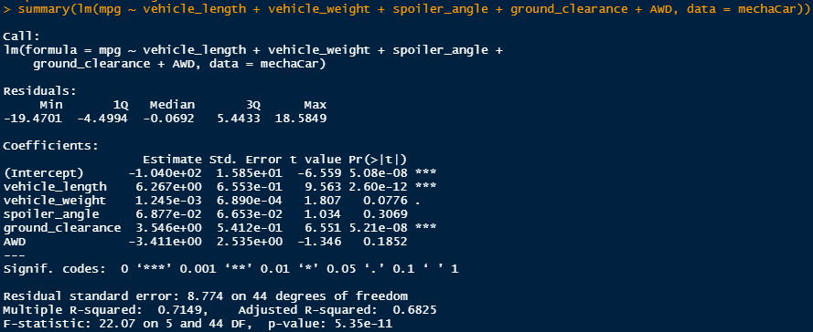

# MechaCar_Statistical_Analysis

## Linear Regression to Predict MPG

* summary table of a linear model: 

A linear regression analysis was performed on 50 prototype MechaCars to predict MPG based on five other variables.
Based on the above summary table, it can be determined that two variables, vehicle length and ground clearance, have a statistically significant, non-random impact on the fuel efficiency of the MechaCar.

The slope of the of regression was calculated to be -1.04e+02, or -104. As this is a non-zero number, the slope cannot be considered zero.

This linear model does effectively predict the mpg of the MechaCar. According to the summary table above, the multiple R-Squared value is 0.71, meaning that 71% of variability of the MechaCa's mpg can be explained using this linear model.

