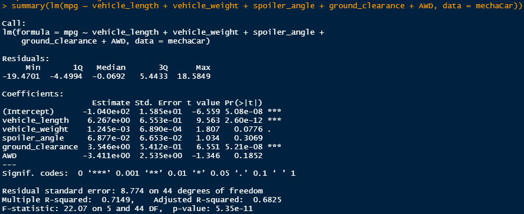
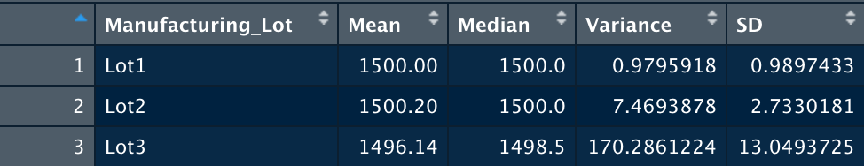
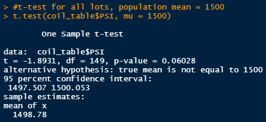
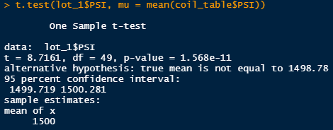
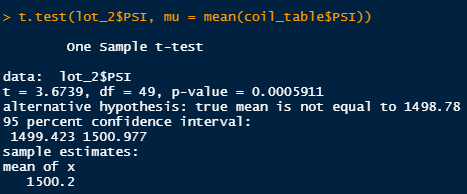
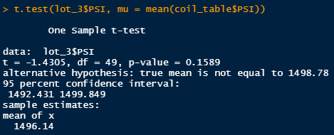

# MechaCar_Statistical_Analysis

## Linear Regression to Predict MPG

-   summary table of a linear model: 

1.  A linear regression analysis was performed on 50 prototype MechaCars to predict MPG based on five other variables. Based on the above summary table, it can be determined that two variables, vehicle length and ground clearance, have a statistically significant, non-random impact on the fuel efficiency of the MechaCar.

2.  The slopes of each regression are listed under the "estimate" column. Each coefficient, when converted from scientific notation are all non-zero number, indicating that the slope is considered to be not zero.

The converted coefficients are: vehicle length: 6.267 vehicle weight: .001 spoiler angle: .069 ground clearance: 3.546 AWD: -3.411

3.  This linear model does effectively predict the mpg of the MechaCar. According to the summary table above, the multiple R-Squared value is 0.71, meaning that 71% of variability of the MechaCar's mpg can be explained using this linear model. 0.71 is considered to be a strong, positive correlation.

## Summary Statistics on Suspension Coils

The design specifications for the suspension coils state that the variance in the PSI (pounds/square inch) must not exceed 100psi. Below is a table of summary statistics for the PSI of all the suspension coils on the lot.

Based on this table, it appears that the coils all meet the PSI requirements for variance. However, when the cars are grouped by their lot number, this requirement does not hold. As shown in the table below, the variance in lot 3 is 170.28psi, which is over the maximum variance allowed. Based on these two charts, the coils from lots 1 and 2 pass the specification requirements, while the coils from lot 3 do not.

## T-Tests on Suspension Coils

T-tests were performed on the data to determine if the PSI of the sample suspension coils differ from the population mean of 1500psi.

The t-test for all lots returned a p-value of 0.06, which is larger than our alpha of 0.05, meaning there is no statistically significant difference in the PSI of all coils from the population mean of 1500.

The t-test performed only on cars in lot 1 returned a p-value of 1.57e-11, which is \< than our alpha of 0.05 and it can be concluded that there is a significant difference in the PSI of lot 1 versus the population.

The t-test for lot2 resulted in a p-value of 0.0006, meaning we can conclude there is a statistically significant difference in PSI in lot 2 when compared to the population.

The t-test for lot2 resulted in a p-value of 0.159, meaning we cannot conclude there is a statistically significant difference in PSI in lot 2 when compared to the population.

## Study Design: MechaCar vs Competition

Further studies on the performance of MechaCar vs competition could be performed on a variety of important factors. Price point, fuel efficiency, safety, and maintenance cost are all legitimate metrics that should be looked into.

-   I would personally like to test for how the fuel efficiency of the MechaCar compares to comparably priced and sized cars on the market.
-   The null hypothesis (H~0~) is that there is no difference in fuel efficiency between the MechaCar and other comparable cars on the market. The alternate (H~A~) is that the MechaCar produces a higher fuel efficiency in miles per gallon than comparable cars on the market. 
- This could be accomplished in a similar manner to above, using a t-test would accomplish this comparison, allowing the mpg of the MechaCar to be compared to the "population" mpg of similar cars on the market. 
- The data required would be a fuel efficiency readings from both MechaCars and the cars that would be compared against the MechaCar. 
